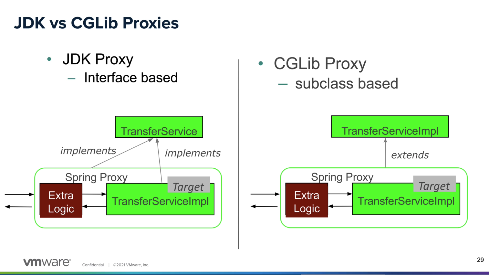
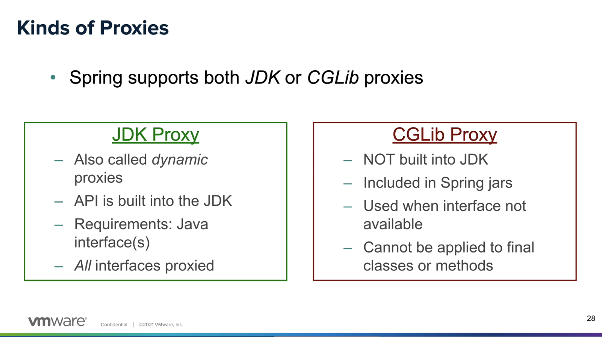
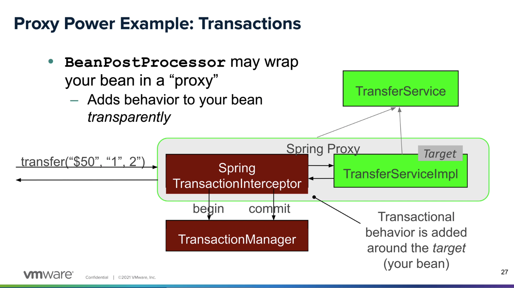

JDK Proxy e CGLib Proxy



Objetivo: Entendimento claro da diferença entre os dois proxies.



# JDK Dynamic Proxy

De acordo com a [documentação](https://docs.oracle.com/javase/8/docs/technotes/guides/reflection/proxy.html), diz que Dynamic Proxy Class é 
uma implementação da java.lang.reflect.Proxy.

Você tem um proxy mais leve, comparado ao CGLib, e usa uma abordagem mais direta. (Sem ter que extender da classe que a implementa, como mostra a foto)

Exemplo direto:

```java
// Main.java
TransferService service = context.getBean(TransferService.class);
service.pay();
```

O que é exatamente o service? 

Considere o src/main/java/com/example/demo/transfer/TransferService.java

Isto é uma interface, e cumpre o requisito de ter uma classe que a implementa.

Então por que temos esse resultado?

```java
//class com.example.demo.transfer.TransferServiceImpl
System.out.println(service.getClass());
//com.example.demo.transfer.TransferServiceImpl@79d8407f
System.out.println(service);
```

Não deveriamos receber o JDK Dynamic Proxy? Eu fiz exatamente o que diz no blog que diz:

```java
public interface MyService {
    void performAction();
}
@Service
public class MyServiceImpl implements MyService {
    @Override
    public void performAction() {
        System.out.println("Action performed");
    }
}
//In this scenario, Spring uses JDK Dynamic Proxy because 
//MyServiceImpl implements MyService. 
//Spring creates a proxy that implements the same interfaces and 
//delegates method calls to the target object
```

Aqui falta uma informação: O Spring não fica gerando proxy para todos os Beans, ele cria quando é necessário!

é importante verificar que na [documentação](https://docs.spring.io/spring-framework/reference/core/beans/factory-extension.html) diz:

> Um BeanPostProcessor normalmente verifica se o bean implementa determinadas interfaces de callback ou pode envolver (wrap) o bean com um proxy. Algumas classes da infraestrutura do Spring AOP são implementadas como BeanPostProcessors justamente para fornecer essa lógica de criação de proxies.

No nosso caso, não temos motivo para ter AutoProxy.

Precisamos de proxy quando temos um @Transactional (por que precisa do TransactionManager do Spring), 
@Cacheable, @Async, ou algum recurso que o Spring precisa gerir.

Vamos implementar por exemplo o [@Transactional](https://docs.spring.io/spring-framework/docs/current/javadoc-api/org/springframework/transaction/annotation/Transactional.html), que é o exemplo mais comum.



Vamos mudar disso:

```java
package com.example.demo.transfer;

import org.springframework.stereotype.Service;

@Service
class TransferServiceImpl implements TransferService {

    @Override
    public void pay() {
        System.out.println("Efetuando Transferencia");
    }
}
```

para isto:

```java
package com.example.demo.transfer;

import org.springframework.stereotype.Service;

@Service
class TransferServiceImpl implements TransferService {

    @Override
    @Transactional
    public void pay() {
        System.out.println("Efetuando Transferencia");
    }
}
```

Ao configurar o TransactionManager no AppConfig, e adicionar o @Transactional, pode ver isso:

```java
class jdk.proxy2.$Proxy18
com.example.demo.transfer.TransferServiceImpl@a37aefe
Efetuando Transferencia
```

Referências:

- [Spring AOP APIs](https://docs.spring.io/spring-framework/reference/core/aop-api.html)
- [Transaction Management](https://docs.spring.io/spring-framework/reference/data-access/transaction.html)
- [Spring - @Transactional - What happens in background?](https://stackoverflow.com/questions/1099025/spring-transactional-what-happens-in-background)
- [Transaction Manager](https://docs.spring.io/spring-framework/docs/current/javadoc-api/org/springframework/transaction/annotation/Transactional.html#transaction-management-heading)

# CGLib

Com base no que ja vimos acima, vamos só criar um serviço e testar:

```java
package com.example.demo.payment;

import org.springframework.stereotype.Service;
import org.springframework.transaction.annotation.Transactional;

@Service
public class PaymentService {
    @Transactional
    public void pay() {
        System.out.println("Efetuando Transferencia");
    }
}
```

Como vemos, o proxy foi aplicado, mas não implementa a interface, teve que escolher o CGLib:

```java
class com.example.demo.payment.PaymentService$$SpringCGLIB$$0
com.example.demo.payment.PaymentService@f99f5e0
Efetuando Transferencia
```

